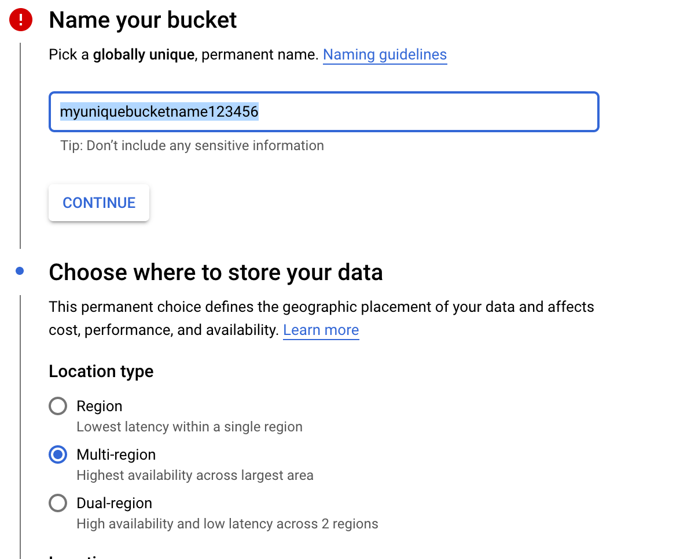
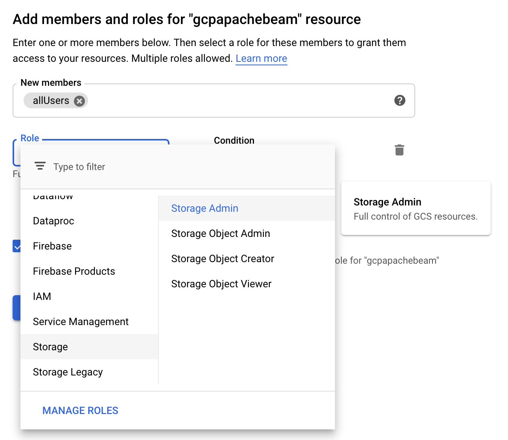
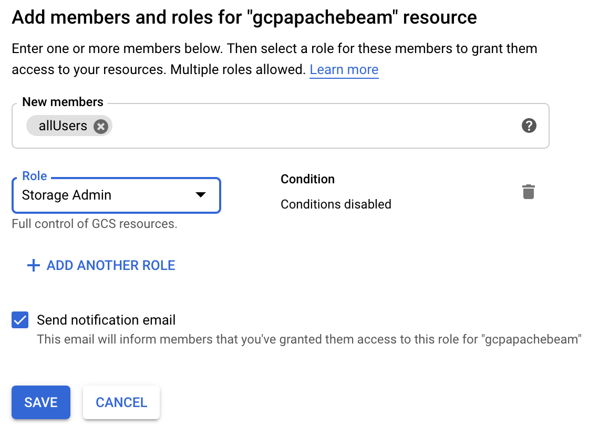

#### Configuring bucket

**1.** From **Cloud Console**, open the navigation menu and click on **Storage**

**2.** Once there, click on **Create Bucket**. It will show a form that you need to fill. Input the name of your bucket
and, for this practical scenario, let's keep the rest of the configuration as it is and click on **Create**.
An image of it below:

**3.** Now we need to set permissions, so users and other applications (internal or external) could access the resources stored here.
From Cloud Console go to **Storage**, then click on the bucket just created, click on **Permissions** and finally click on **Add members**.

**4.** Let's give public access to this bucket, so anybody could access the resources stored here.
However, **this is for testing purpose, it's not intended for production or sensible environments**.
Making that clear, let's fill the form as the image below:

**5.** At the end, make sure it looks like the image below. After that, save changes.

**6.** Now, let's placed the .csv files that the application is supposed to process.
From Cloud Console go to **Storage**, click on the bucket created, click on **Create folder**. Name it "csv" and save changes.
Inside the csv folder of the bucket, put the csv files that are on the path [/data/csv](../data/csv) of this repository. 