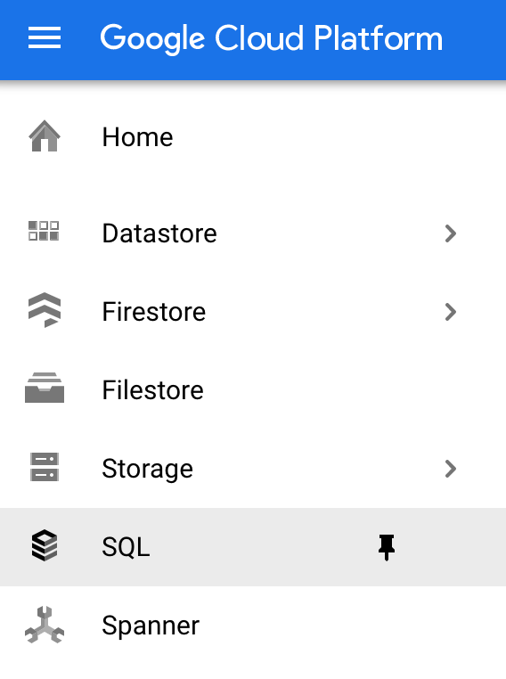
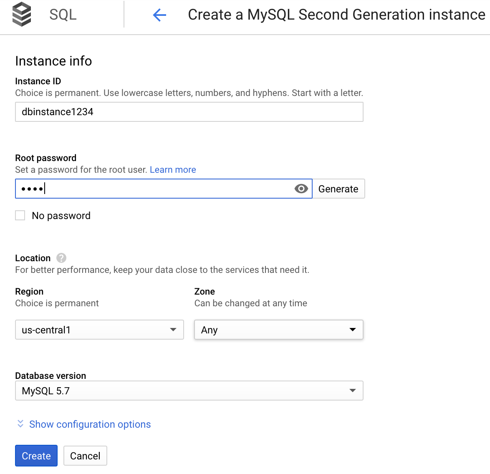
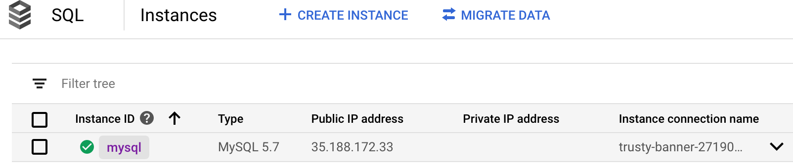
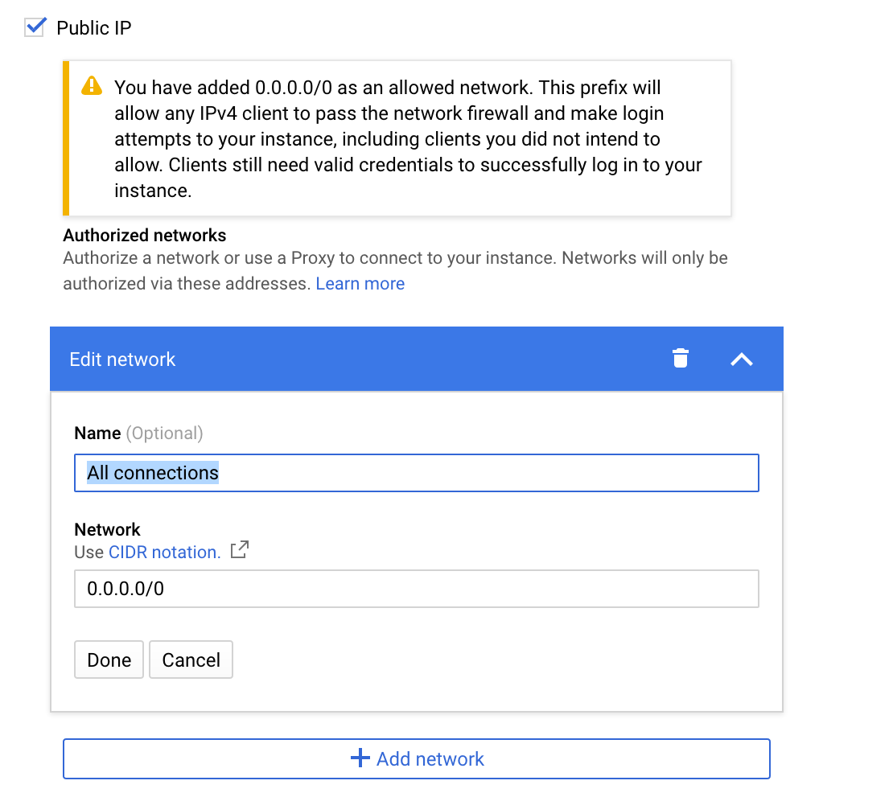

#### Configuring database

**1.** From **Cloud Console**, open the navigation menu and click on **SQL**


**2.** It will ask you to choose the project you want to create the database for

**3.** Click on **Create Instance** and then choose MySQL

**4.** It will show a form. Fill it with the requested parameters and finally click on **Create**


**5.** Now we need to add connection permission in order to establish a connection to it from the outside.
From Cloud Console go to **SQL**. Once there, it will list the instance just created along with other parameters
like **Public IP Address** (that's the address we will use to establish connection, but we need to set permission first).
Click on the name of your instance.


**6.** It will display an overview of your instance. Click on **Connections** at the left side.
Here it is possible to configure connections. Make sure **Public IP** is checked and then click on **Add network**.
Ideally you have to define specifically all IP's and networks that are able to establish a connection to this instance.
However, **for testing purpose** we are going to allow connections from anywhere (**that's not for production environment**).
Set it as shown in the image below and then save changes:


**7.** Now you should be able to connect to your instance. Try it out by establishing a connection with a MySQL client.
```sh
    mysql --host=instance-public-address --user=your-instance-user -p
```

An example of it could be:
```sh
    mysql --host=35.188.172.33 --user=root -p
```

**Note:** The user you are using here, was created on step **4** ("root" and you set also a password for it)

**8.** Once connected to the database, let's create a dummy table in which the data will be inserted.
For that, run the [schema.sql](../schema.sql) file in your GCP instance