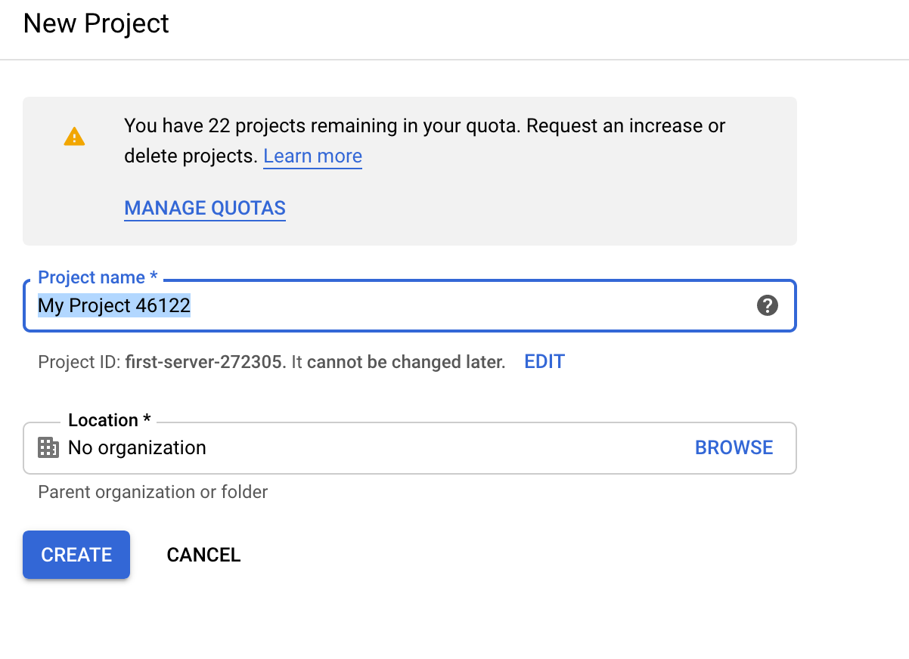

#### Creating a Google Cloud Project

**1.** Go to [Google Cloud Platform](https://cloud.google.com/) and login in there with your google account

**2.** Once there, click on the **Console** (aka Cloud Console) button at the top right corner of the screen

**3.** Click on **New Project** and after that, a form will be displayed. Fill it with the requested data and
finally click on **Create**. Below an image of the form

