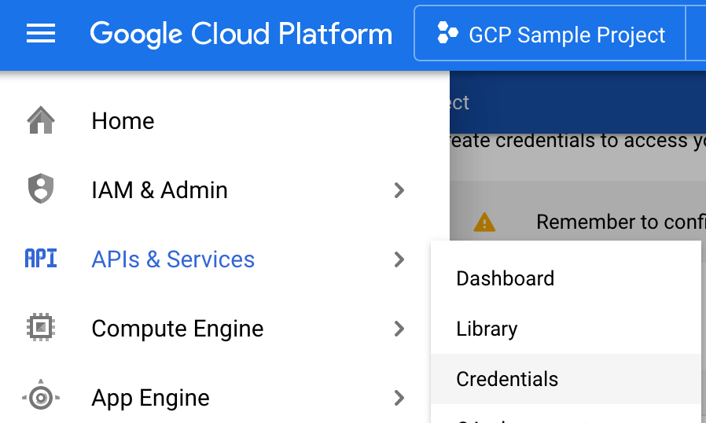
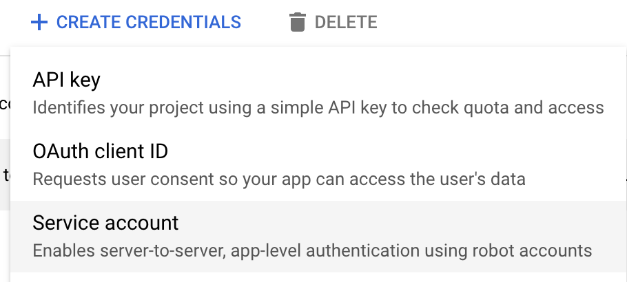
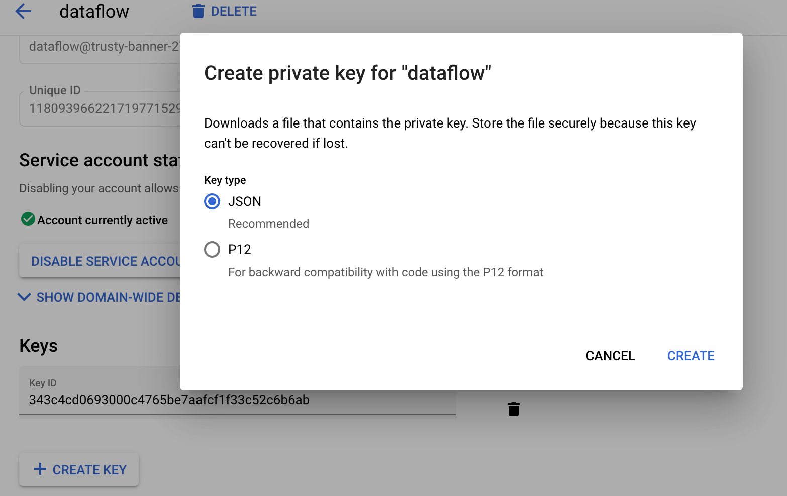

#### Generating SSH key

Any application that is not deployed in our project needs access to our GCP resources. One approach for giving access
to external applications is creating a SSH key. Below it's described the process to create a GCP SSH key.

* **Note:** It's highly recommended to read [this document](https://cloud.google.com/iam/docs/service-accounts) to get
a better understanding about GCP accounts.

**1.** From **Cloud Console**, open the navigation menu and click on **APIs & Services** and then go to **Credentials**

**2.** Once there, click on **+Create Credentials** and choose **Service Account**

**3.** It will show up a form. Fill the fields and then click on **Create**

**4.** After create the service account, go again to **Credentials**. Now, our account should be displayed at **Service Accounts** section.
Click on the account just created.

**5.** Now, click on **Create Key**. It will ask you to choose the key type. Choose **json** type and click create.
After that, it will download a .json file. 

Put that .json file under the root folder of the project and rename it to
**gcp-key.json**. It's important to consider that **this key should be kept in secret**. We are saving it on this project
just for **testing purpose**, it's not a proper way to store the key at all.
Once you are done with this step, the application should be able to establish connection to GCP and consume your resources.